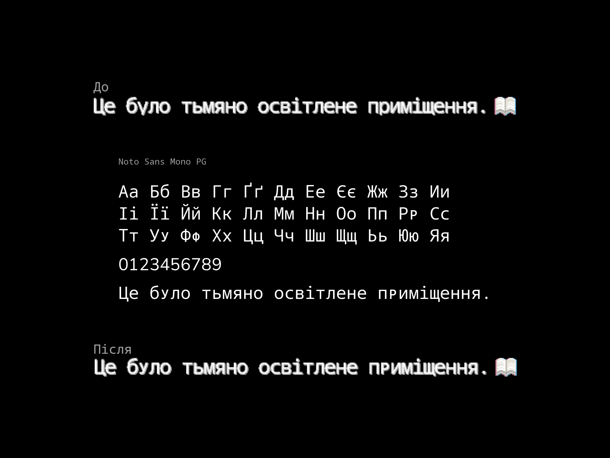

# Noto Sans Mono Pigeon

Японська візуальна новела, яку я перекладаю українською, обрізає нижні частини літер у/ф/р, тому я зібрав цього франкенштейна. Проблемні маленькі літери замінені зменшеними версіями великих. 

Базовий шрифт

[NotoSansMono-Regular.ttf](https://github.com/notofonts/notofonts.github.io/blob/main/fonts/NotoSansMono/hinted/ttf/NotoSansMono-Regular.ttf)

Шрифт-донор для зменшених літер (варіативний фонт було простіше підігнати візуально)

[NotoSansMono\[wdth,wght\].ttf](https://github.com/notofonts/notofonts.github.io/blob/main/fonts/NotoSansMono/googlefonts/variable-ttf/NotoSansMono%5Bwdth%2Cwght%5D.ttf)

Шрифт-донор для цифр (вони виглядають краще, ніж monospace варіант в базовому шрифті)

[NotoSans-Regular.ttf](https://github.com/notofonts/notofonts.github.io/blob/main/fonts/NotoSans/full/ttf/NotoSans-Regular.ttf)
